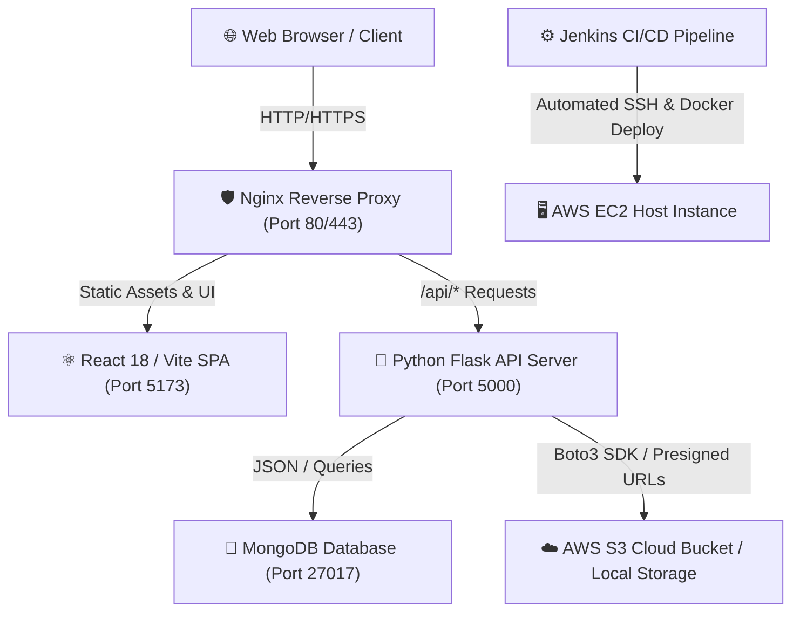

# CloudVault | Secure Cloud Storage Hub ☁️🔒

[](https://github.com/)
[](https://react.dev/)
[](https://flask.palletprojects.com/)
[](https://www.mongodb.com/)
[](https://www.docker.com/)
[](https://aws.amazon.com/)
[](https://www.jenkins.io/)

**CloudVault Pro** is an enterprise-grade, end-to-end secure cloud storage, file management, and real-time collaboration platform. Built with modern full-stack web technologies, it features automated multi-container orchestration, seamless S3 cloud integration, Google Drive–style public link sharing, and robust JWT-based multi-tenant security.

### 🌐 Live Production Application
Experience the fully deployed, enterprise-certified CloudVault platform live on AWS EC2:  
👉 **[https://cloudvault-pranav.duckdns.org/](https://cloudvault-pranav.duckdns.org/)**

---

## 🌟 Key Features

### 🔐 Enterprise Security & Authentication
- **Multi-Tenant Isolation**: Strict ownership validation (`ownerId == user_id`) ensures users can only view, modify, or delete their own stored assets.
- **Bcrypt Password Hashing**: Passwords are salted and encrypted using industrial-standard Bcrypt algorithms before database storage.
- **JWT Bearer Authorization**: Stateless authentication powered by `Flask-JWT-Extended` with automatic token expiration and silent authentication state verification.
- **AWS S3 Presigned URLs**: Files stored in Amazon S3 generate secure, time-limited presigned download URLs on the fly, keeping private buckets completely blocked from public access.

### 📁 Advanced File Management & Organization
- **Drag & Drop Uploads**: Upload multiple files simultaneously with instant storage progress tracking, automatic file type categorization, and size normalization.
- **Real-Time Search & Filtering**: Fast, case-insensitive regex search filtering across display names and system filenames, fully synchronized with URL parameters (`/files?search=query`) for seamless page sharing and bookmarking.
- **Storage Quota & Analytics**: Live visual storage distribution breakdown (Documents, Media, Archives, Code) and real-time remaining capacity tracking.
- **Flexible Workspace Views**: Toggle effortlessly between rich visual Grid Cards and detailed Table Rows.

### 👁️ In-App Media & Document Previews
- **Authenticated Preview Stream**: Bypasses browser 401 Unauthorized errors by fetching secure binary streams via Axios with JWT headers.
- **Multi-Format Support**:
  - **🖼️ Images**: High-resolution rendering with smooth scaling.
  - **🎬 Videos & 🎵 Audio**: Integrated HTML5 media players with timeline controls and custom audio player interfaces.
  - **📄 PDFs**: Native embedded iframe document viewer for instant reading without downloading.
  - **💻 Code & Plain Text**: Syntax-highlighted text block display for `.js`, `.py`, `.json`, `.md`, `.txt`, `.html`, and more.

### 🌐 Google Drive–Style Link Sharing & Collaboration
- **Granular Access Control**: Toggle file permissions between **🔒 Restricted** (private to account owner) and **🌐 Anyone with the link** (public read/download access).
- **One-Click Link Generation**: Generates unique, hard-to-guess UUID share tokens with instant clipboard copy functionality.
- **Standalone Public Viewer (`/share/:shareToken`)**: External collaborators can view file metadata, category badges, file sizes, and download shared files securely without needing to register or log in.

### 🎨 Premium UI/UX & Aesthetics
- **Vibrant Modern Design**: Styled with Vanilla CSS and Tailwind CSS utilities featuring glassmorphism cards, curated HSL color palettes, and smooth dark/light theme switching.
- **Micro-Animations**: Powered by **Framer Motion** for silky modal transitions, layout animations, and interactive hover states.

---

## 🏗️ System Architecture & Technology Stack



| Component | Technology | Description |
| :--- | :--- | :--- |
| **Frontend** | React 18, Vite, Tailwind CSS, Framer Motion | Single-page application with responsive layouts, route code-splitting, and toast notifications. |
| **Backend** | Python 3.11, Flask, Flask-RESTful / Blueprints | REST API server enforcing standardized JSON contracts (`{ success, message, data }`). |
| **Database** | MongoDB, PyMongo, Mongo Express | Document database storing user profiles, file metadata, categories, and share tokens. |
| **Cloud Storage** | AWS S3, Boto3 SDK, Local File System | Hybrid storage engine supporting local disk development and production S3 buckets. |
| **DevOps & IaC** | Docker, Docker Compose, Nginx, Terraform | Containerized multi-stage builds, reverse proxy routing, and automated infrastructure provisioning. |
| **CI/CD** | Jenkins Pipeline (`Jenkinsfile`, Shell scripts) | Automated zero-downtime deployment pipelines targeting AWS EC2 environments. |

---

## 📂 Repository Folder Structure

```text
CloudVault/
├── backend/                  # Python Flask API backend
│   ├── models/               # MongoDB models (user_model.py, file_model.py)
│   ├── routes/               # API Blueprints (auth, files, storage, health)
│   ├── services/             # Core business logic (S3/local storage, share streams)
│   ├── utils/                # Standardized JSON response formatting & helpers
│   ├── Dockerfile            # Production backend container build instructions
│   ├── requirements.txt      # Python package dependencies
│   └── run.py                # WSGI application entry point
├── frontend/                 # React 18 / Vite frontend SPA
│   ├── public/               # Static assets (custom CloudVault favicon.svg)
│   ├── src/
│   │   ├── components/       # Reusable UI components (modals, charts, file cards/rows)
│   │   ├── context/          # React Context providers (AuthContext, ThemeContext)
│   │   ├── hooks/            # Custom hooks (useFiles, useAuth, useTheme)
│   │   ├── pages/            # View components (Dashboard, Files, Upload, SharedFileView)
│   │   ├── services/         # Axios API wrapper & response interceptors
│   │   └── utils/            # Constants & byte/date formatting utilities
│   ├── Dockerfile            # Multi-stage Nginx build for React production bundle
│   ├── index.html            # Main HTML shell with branded title & cache-busted favicon
│   └── package.json          # Node.js dependencies and build scripts
├── jenkins/                  # CI/CD automation & deployment scripts
│   ├── build.sh              # Container image verification & tag build script
│   └── deploy.sh             # Zero-downtime EC2 Docker container replacement script
├── terraform/                # Infrastructure as Code (IaC)
│   ├── main.tf               # AWS provider & S3 storage bucket provisioning
│   └── variables.tf          # Configurable cloud infrastructure variables
├── docker-compose.yml        # Full-stack container orchestration (Frontend, API, DB, Admin)
├── FINAL_CODE_REVIEW.md      # Comprehensive engineering audit & verification report
└── README.md                 # Project documentation
```

---

## 🚀 Getting Started & Local Development

### Option 1: One-Click Full-Stack Deployment with Docker (Recommended)

You can launch the entire stack (Frontend web server, Backend API, MongoDB database, and Mongo Express admin UI) with a single command using Docker Compose:

1. **Clone the repository**:
   ```bash
   git clone https://github.com/yourusername/CloudVault.git
   cd CloudVault
   ```

2. **Configure environment variables**:
   Create a `.env` file in the root directory (or copy from examples) with your desired configuration:
   ```env
   # Backend Secrets & Storage Config
   PORT=5000
   MONGO_URI=mongodb://mongodb:27017/cloudvault
   JWT_SECRET_KEY=super-secret-enterprise-jwt-key-change-in-prod
   STORAGE_TYPE=local

   # Optional AWS S3 Configuration (if STORAGE_TYPE=s3)
   AWS_ACCESS_KEY_ID=your_access_key
   AWS_SECRET_ACCESS_KEY=your_secret_key
   AWS_S3_BUCKET=your-cloudvault-bucket
   AWS_REGION=us-east-1

   # Frontend Config
   VITE_API_BASE_URL=http://localhost:5000/api
   VITE_APP_NAME=CloudVault
   ```

3. **Build and start containers**:
   ```bash
   docker compose up -d --build
   ```

4. **Access the platform**:
   - **🌐 Live Production Application**: [https://cloudvault-pranav.duckdns.org/](https://cloudvault-pranav.duckdns.org/)
   - **💻 Local Web App**: [http://localhost](http://localhost) (or `http://localhost:5173` depending on proxy setup)
   - **🔌 Backend API Health Check**: [http://localhost:5000/api/health](http://localhost:5000/api/health)
   - **🍃 Mongo Express Admin Panel**: [http://localhost:8081](http://localhost:8081) *(Default HTTP Auth: `admin` / `pass`)*

---

### Option 2: Manual Local Development Setup

#### 1. Backend Setup (Flask API)
```bash
cd backend
python -m venv venv

# On Windows:
venv\Scripts\activate
# On macOS/Linux:
source venv/bin/activate

pip install -r requirements.txt
python run.py
```
*The Flask development server will start on port `5000`.*

#### 2. Frontend Setup (React / Vite)
Open a new terminal window:
```bash
cd frontend
npm install
npm run dev
```
*The Vite development server will start on port `5173` with instant Hot Module Replacement (HMR).*

---

## 📡 API Endpoints Reference

All API routes return standardized JSON structures conforming to:
```json
{
  "success": true,
  "message": "Operation successful",
  "data": { ... }
}
```

### 🔐 Authentication (`/api/auth`)
| Method | Endpoint | Description | Auth Required |
| :--- | :--- | :--- | :--- |
| `POST` | `/api/auth/register` | Register a new user account with Bcrypt password hashing | ❌ No |
| `POST` | `/api/auth/login` | Authenticate user credentials and return JWT Bearer token | ❌ No |
| `GET` | `/api/auth/me` | Get current authenticated user profile details | ✅ Yes |

### 📁 File Management & Sharing (`/api/files`)
| Method | Endpoint | Description | Auth Required |
| :--- | :--- | :--- | :--- |
| `GET` | `/api/files` | List paginated files with optional `search` and `category` filters | ✅ Yes |
| `POST` | `/api/files/upload` | Upload new file(s) via `multipart/form-data` to local or S3 storage | ✅ Yes |
| `GET` | `/api/files/<id>/download` | Securely download file or stream S3 presigned URL | ✅ Yes |
| `PUT` | `/api/files/<id>/rename` | Rename existing file display name | ✅ Yes |
| `DELETE` | `/api/files/<id>` | Delete file metadata and wipe stored binary from disk/S3 | ✅ Yes |
| `PUT` | `/api/files/<id>/share` | Toggle General Access (`public`/`private`) and generate share UUID token | ✅ Yes |
| `GET` | `/api/files/share/<token>` | Get public file metadata for external share link viewers | ❌ No |
| `GET` | `/api/files/share/<token>/download` | Stream public shared file download | ❌ No |

### 📊 Storage & Health (`/api/*`)
| Method | Endpoint | Description | Auth Required |
| :--- | :--- | :--- | :--- |
| `GET` | `/api/storage/metrics` | Retrieve total quota, used space, remaining space, and category breakdown | ✅ Yes |
| `GET` | `/api/health` | System health check (Database status, storage connectivity, timestamp) | ❌ No |

---

## ⚙️ CI/CD Automation & Cloud Deployment

CloudVault includes an automated Jenkins CI/CD pipeline configured in `Jenkinsfile` and supported by automation scripts in the `jenkins/` directory:

1. **Build Phase**: Validates Python syntax, checks React bundle compilation, and builds optimized Docker container images tagged with unique commit hashes (`build.sh`).
2. **Test Phase**: Executes automated backend health verification checks against temporary ephemeral test containers.
3. **Deploy Phase**: Connects via secure SSH to target AWS EC2 instances, pulls updated Docker layers, and executes graceful zero-downtime container replacements (`deploy.sh`).

---

## 🔒 Security & Best Practices

- **Zero Secret Leakage**: Strict `.gitignore` and `.dockerignore` files prevent `.env`, `.pem` keys, and local database state from ever being committed or exposed in Docker layers.
- **Client IP Preservation**: Production Nginx configuration passes true client headers (`X-Real-IP`, `X-Forwarded-For`) to backend logging systems for accurate rate-limiting and audit tracking.
- **S3 Bucket Hardening**: Amazon S3 buckets are configured with private IAM policies; files are served exclusively through short-lived presigned AWS URLs generated by backend backend services.

---